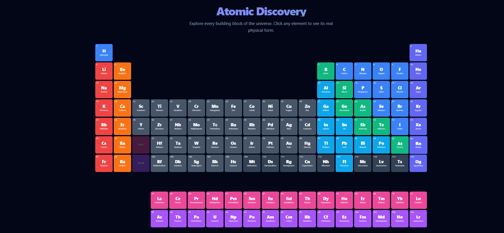
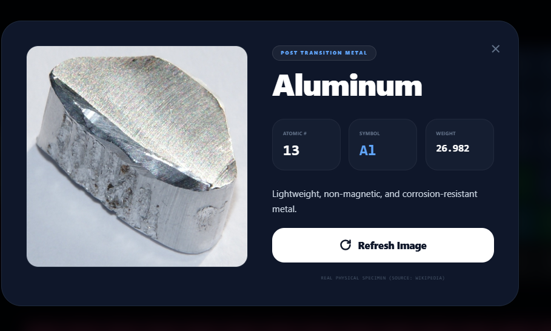

# ⚛️ Atomic Discovery

### An Interactive, AI-Powered Periodic Table Experience


---

## 📘 Overview

**Atomic Discovery** is a high-performance, interactive periodic table web application featuring **all 118 chemical elements**. The project uniquely combines **AI-generated visualizations** with **real-world scientific references**, delivering both educational accuracy and modern UI aesthetics.

Designed as a **Single-File Application (SFA)**, it is lightweight, portable, and easy to deploy—ideal for students, educators, and science enthusiasts.

---

## 🚀 Features

### 🔬 Complete Periodic Table

* Scientifically accurate layout (IUPAC standard)
* Includes **Lanthanides & Actinides**
* Clear grouping and periodic alignment

### 🧾 Interactive Element Details

Click any element to view:

* Atomic Number
* Chemical Symbol
* Atomic Weight
* Short scientific description
* Realistic visual representation

### 🧠 Hybrid "Real Picture" Visualization Engine

**AI Synthesis Mode**

* Uses **Google Gemini Imagen (v4.0)**
* Generates high-resolution macro-style element imagery

**Smart Wikipedia Fallback**

* Automatically activates if:

  * API key is missing
  * Network is limited
* Fetches real laboratory or mineral specimen images

✔️ Guarantees reliable visualization in all environments

### 🎨 Modern UI / UX

* Built with **Tailwind CSS**
* Dark-mode **Laboratory aesthetic**
* Glassmorphism panels
* Smooth hover and modal animations

### 📱 Responsive Design

* Desktop, tablet, and mobile optimized
* Scroll-friendly periodic grid

---

## 🖼️ Screenshots

### 🔬 Main Periodic Table View




### 🧠 AI Generated Visualization




---

## 📁 Project Structure

```
atomic-discovery/
│
├── periodic_table.html   # Full application (HTML + Tailwind + JS)
├── screenshots/          # README visuals
│   ├── periodic-table.png
│   ├── ai-visualization.png
└── README.md
```

---

## 🛠️ Tech Stack

### Core Technologies

* HTML5
* JavaScript (ES6+)
* Tailwind CSS
* Inter Font

### APIs & Data Sources

* Google Gemini API (Imagen 4.0)
* Wikipedia REST API
* IUPAC Standard Periodic Data

### Developer Tools

* VS Code
* Live Server Extension
* Chrome / Edge DevTools

---

## 📦 Local Setup

### 1️⃣ Clone Repository

```bash
git clone https://github.com/mohammademon10/atomic-discovery.git
cd atomic-discovery
```

### 2️⃣ Open in VS Code

```bash
code .
```

### 3️⃣ Run with Live Server

* Install **Live Server** extension
* Right-click `periodic_table.html`
* Select **Open with Live Server**

⚠️ Required to avoid CORS issues with fetch requests.

---

## 🔐 API Configuration (Optional)

To enable AI-generated images:

```js
const GEMINI_API_KEY = "YOUR_API_KEY_HERE";
```

If not provided, the app automatically switches to Wikipedia fallback mode.

---

## 🌐 Live Demo

🔗 **Live Application**
[https://mohammademon10.github.io/atomic-discovery/](https://mohammademon10.github.io/Atomic-Discovery/)

📂 **Source Code**
[https://github.com/mohammademon10/atomic-discovery](https://github.com/mohammademon10/atomic-discovery)

---

## 🎯 Use Cases

* Chemistry students & learners
* Teachers and educators
* Science demonstrations
* UI/UX & frontend inspiration

---

## 🚧 Future Enhancements

* Element comparison mode
* Search & filter system
* PWA / Electron version
* Quiz & learning mode
* 3D atomic visualization

---

## 📜 License

This project is licensed under the **MIT License**.

---

## 🤝 Contributing

Contributions are welcome:

1. Fork the repository
2. Create a feature branch
3. Commit your changes
4. Submit a Pull Request

---

## ⭐ Support

If you find this project helpful:

* Star the repository
* Share it with others

---

## 👨‍💻 Author

**Md. Emon Hossain**
Computer Science & Engineering
Daffodil International University


